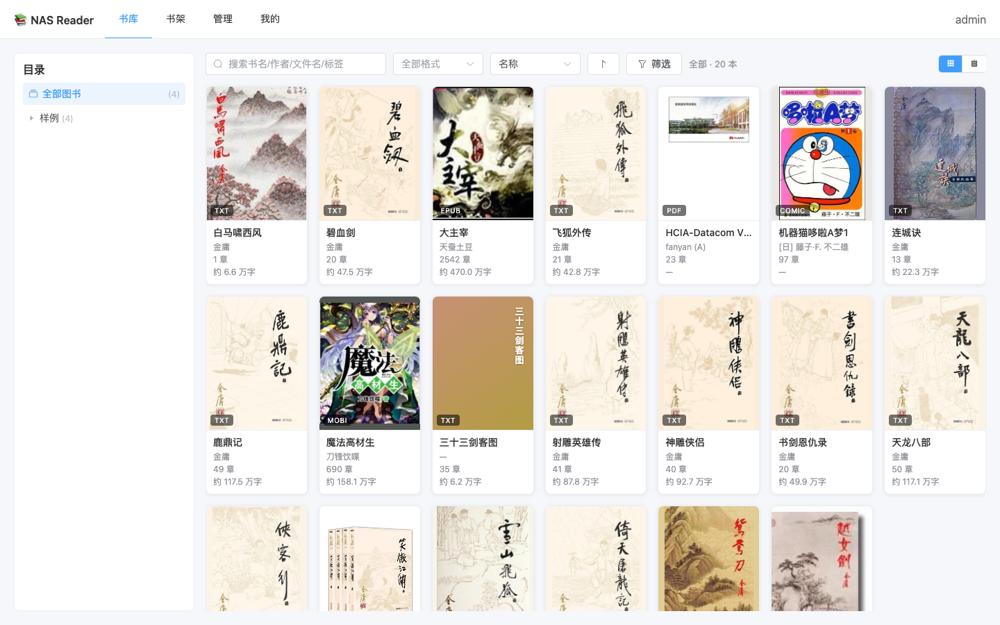
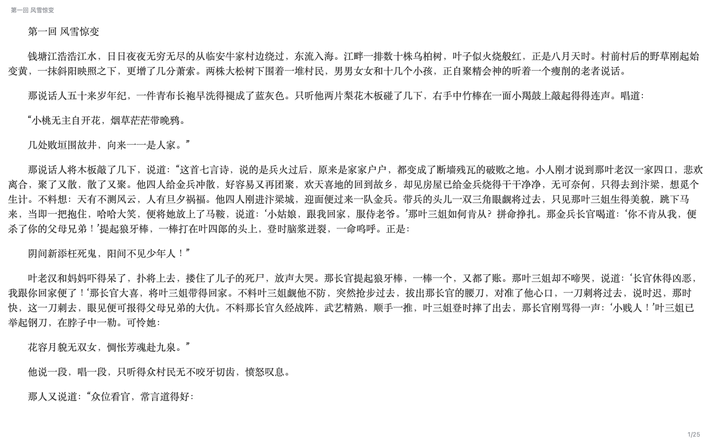
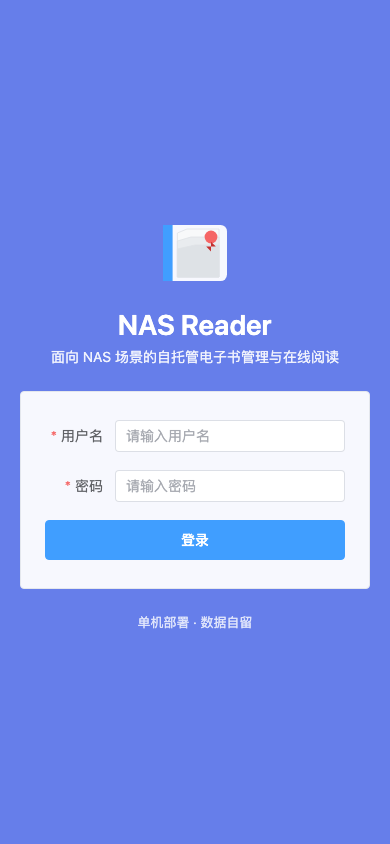
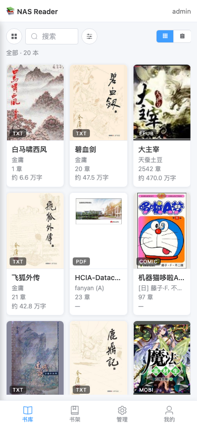
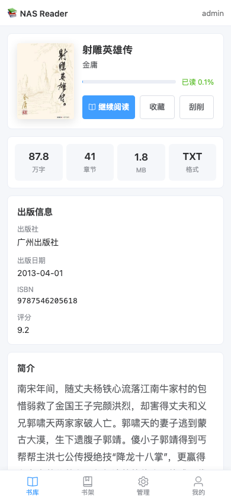
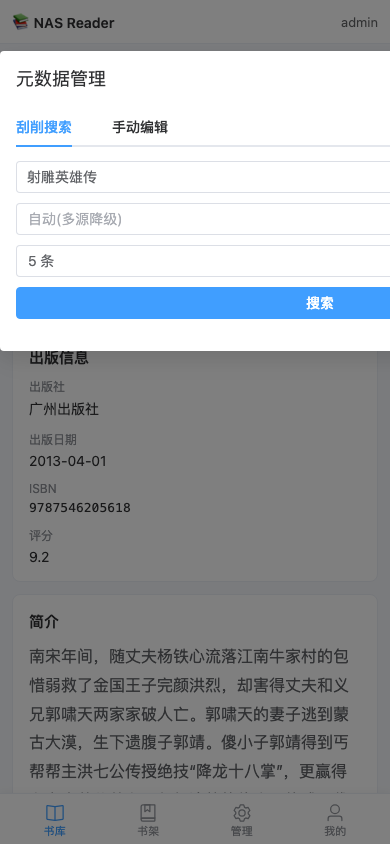
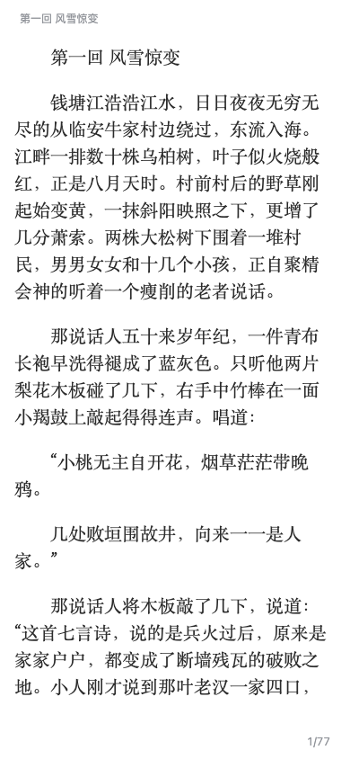

# NAS Reader — 电子书管理与阅读应用

> **本项目所有代码全部由 [Claude Code](https://claude.ai/code) 开发完成**。

面向 NAS 场景的自托管电子书管理与在线阅读应用。通过 docker-compose 一键部署，把本地/NAS 上的书目录映射进容器即可管理和阅读。

## 技术栈

| 层 | 技术 |
|---|---|
| 后端 | Python 3.11 + FastAPI + SQLAlchemy(async) + Alembic |
| 数据库 | SQLite(单文件,零运维) |
| 前端 | Vue 3 + Vite + TypeScript + Pinia + Element Plus |
| 阅读器 | txt/epub/mobi 前端重排渲染；pdf 用 pdf.js 原生渲染；漫画自动旋转 |
| 后台任务 | 进程内 APScheduler(扫描/刮削) |
| 部署 | docker-compose 单容器(FastAPI 同时托管 API 与前端静态资源) |

## 功能

- 📁 **文件源管理**:映射目录为文件源，手动 + 自动扫描，扫描进度实时可见
- 📚 **图书库**:按文件夹层级浏览，支持多种格式
- ⭐ **书架**:每用户单一默认书架，一键收藏/取消
- 🔍 **搜索**:按文件名 + 元数据(标题/作者/标签/描述)模糊匹配
- 🏷️ **刮削**:多源降级(豆瓣网页抓取 → Google Books → Open Library → 手动),刮削过程**实时流式**可视化(SSE 逐步展示请求/命中/失败原因,命中后自动收起过程只留结果),管理员可配置豆瓣 Cookie、管理刮削源的顺序与启用。**目前仅豆瓣源功能经过完整测试**,Google Books/Open Library 未测试可用性。
- 👥 **多用户**:管理员创建用户并授权，支持默认文件夹权限
- 👤 **「我的」页面**:与书库/书架/管理平级,集中账户信息、修改密码、外观主题、退出登录
- 📖 **阅读**:
  - 文本类(txt/epub/mobi):字体/字号/行距/边距设置
  - PDF:pdf.js 渲染,点击左右翻页 / 中间呼出工具栏,底栏缩放,风格与其它格式统一
  - 漫画(zip/cbz/rar/cbr):
    - 横图自动旋转 90° 放大显示，JS 精确计算最大可用尺寸，充分利用竖屏空间
    - 双页横图模式: 可选从左/右半页开始阅读，跨章翻页自动定位正确的半页
    - 阅读方向为漫画全局设置，管理员设定默认值，普通用户可在阅读器内本地覆盖（不影响他人）
  - 跨章节翻页动画，切后台/关闭页面进度兜底保存
- 🎨 **全局沉浸主题**:明亮 / 暗黑全局换肤,护眼(sepia)限阅读器;iOS PWA 状态栏/刘海随主题染色沉浸;暗黑模式表面色与边界经过调校
- 📱 **PC/移动端自适应**:H5，iOS PWA 全屏无白边，管理页移动端卡片布局;触屏端屏蔽长按系统菜单(保留书名/作者/简介等文本可复制)

当前支持 **txt / epub / pdf / mobi / zip / cbz / rar / cbr**，漫画压缩包支持自动识别横图旋转。

## 功能展示

### PC 端
| 书库主页 | 小说阅读 |
|---------|---------|
|  |  |

### 移动端

| 登录 | 书库网格 |
|------|---------|
|  |  |

| 书籍详情 | 刮削对话框 |
|---------|-----------|
|  |  |

| 小说阅读 | 漫画阅读 |
|---------|---------|
|  |  |

## 快速开始

### 方式一:直接使用已发布镜像(推荐,免构建)

镜像已发布到 Docker Hub([`whitebones/nas-reader`](https://hub.docker.com/r/whitebones/nas-reader)),支持 `linux/amd64` 与 `linux/arm64`。

```bash
# 1. 下载编排文件与环境变量模板
curl -O https://gitea.whitebones.cn:33333/wangwanxiong/nas-reader/raw/branch/main/docker-compose.hub.yml
curl -o .env https://gitea.whitebones.cn:33333/wangwanxiong/nas-reader/raw/branch/main/.env.example

# 2. 编辑 .env,至少修改 JWT_SECRET(可用 openssl rand -hex 32 生成)
# 3. 编辑 docker-compose.hub.yml,把你的书目录映射进 volumes
#    例如:  - /volume1/books:/data/book1:ro

# 4. 拉取并启动
docker compose -f docker-compose.hub.yml up -d

# 5. 访问 http://<host>:8080,首次进入引导页创建管理员
```

后续升级到新版本:`docker compose -f docker-compose.hub.yml pull && docker compose -f docker-compose.hub.yml up -d`

### 方式二:从源码本地构建

```bash
# 1. 准备环境变量
cp .env.example .env
# 编辑 .env，至少修改 JWT_SECRET
# (生产环境弱密钥会拒绝启动;可用 openssl rand -hex 32 生成)

# 2. 映射你的书目录：编辑 docker-compose.yml 中 volumes
#    例如:  - /volume1/books:/data/book1:ro

# 3. 启动(单容器)
docker compose up -d --build

# 4. 访问 http://<host>:8080
#    首次访问会进入引导页，创建管理员账号
```

启动后：
1. 用引导页创建的管理员登录
2. **管理 → 文件源**：添加映射进来的目录(容器内路径，如 `/data/book1`)为文件源，触发扫描
3. **管理 → 用户**：创建用户并授权可访问的文件源
4. 回到**书库**浏览、阅读

> **数据与备份**:所有数据存于单个 SQLite 文件(`dbdata` 卷内 `/data/db/nasreader.db`),封面缩略图存于 `covers` 卷。备份只需复制这两个卷(或 `docker cp` 出 `.db` 文件)。无独立数据库容器,零运维。

## 生产部署安全建议

> **重要**:登录/注册/改密码接口在应用层使用明文传输密码（服务端用 bcrypt 加盐哈希落库,这是行业标准做法）,**密码在网络链路上的机密性完全依赖 HTTPS**。因此**生产环境请务必通过反向代理启用 TLS**,不要让 8080 端口直接暴露在互联网或不可信网络。

三种典型部署形态:

| 场景 | 建议 |
|---|---|
| 仅内网/NAS 局域网访问 | 可直连 HTTP,风险由内网边界控制 |
| 需要公网访问 | **必须**在前面加反向代理 + TLS 证书 |
| 使用群晖/威联通反代 | 在 NAS 的反代面板给 nas-reader 加一条 HTTPS 规则即可,证书由 NAS 自动管理 |

### 方案 A:Caddy(推荐,自动申请与续期证书)

```caddy
# /etc/caddy/Caddyfile
reader.example.com {
    reverse_proxy 127.0.0.1:8080
    encode zstd gzip
}
```

启动 Caddy 后即会自动为该域名申请 Let's Encrypt 证书,零配置。

### 方案 B:Nginx + Let's Encrypt

```nginx
server {
    listen 443 ssl http2;
    server_name reader.example.com;

    ssl_certificate     /etc/letsencrypt/live/reader.example.com/fullchain.pem;
    ssl_certificate_key /etc/letsencrypt/live/reader.example.com/privkey.pem;
    ssl_protocols TLSv1.2 TLSv1.3;

    # HSTS:强制浏览器只走 HTTPS(确认证书稳定后再开启)
    add_header Strict-Transport-Security "max-age=31536000; includeSubDomains" always;

    client_max_body_size 200m;   # 允许上传较大电子书/漫画包

    location / {
        proxy_pass http://127.0.0.1:8080;
        proxy_set_header Host              $host;
        proxy_set_header X-Real-IP         $remote_addr;
        proxy_set_header X-Forwarded-For   $proxy_add_x_forwarded_for;
        proxy_set_header X-Forwarded-Proto $scheme;
    }
}

server {
    listen 80;
    server_name reader.example.com;
    return 301 https://$host$request_uri;
}
```

证书使用 `certbot certonly --nginx -d reader.example.com` 申请,systemd timer 或 cron 会自动续期。

### 其它建议

- **JWT_SECRET**:务必用 `openssl rand -hex 32` 生成一个强随机值填入 `.env`,不要用默认或短字符串
- **管理员密码**:引导页创建时选择足够复杂的密码；应用暂未对登录接口做速率限制,可在反向代理层加一条 `limit_req` 兜底防暴力破解
- **书目录挂载**:保持 `:ro` 只读,应用不会写回源目录

## 元数据刮削

在书籍详情页点「刮削」可从豆瓣 / Google Books / Open Library 抓取标题、作者、出版信息、简介与封面。对话框内会**实时流式展示刮削过程日志**(逐步显示请求了哪个源、命中/失败、失败原因),命中候选后过程区自动折叠、突出结果,可点击展开回看。

管理员可在 **管理后台 → 刮削设置 → 刮削源** 调整来源的**顺序**与**启用状态**:自动模式按从上到下的顺序依次尝试,命中即停止,关闭的源会被跳过。

### 豆瓣 Cookie(推荐配置)

豆瓣对未登录请求反爬严格,容易抓不到结果。管理员可在 **管理后台 → 刮削设置** 粘贴浏览器登录豆瓣后的 Cookie,显著提高成功率:

1. 浏览器登录 [book.douban.com](https://book.douban.com)
2. 打开开发者工具(F12)→ Network → 刷新页面 → 任选一个请求
3. 复制 Request Headers 里的 `Cookie` 值,粘贴到刮削设置并保存

> Cookie 保存在数据库中运行时可改;也可通过环境变量 `DOUBAN_COOKIE` 预置(数据库设置优先)。若三个来源在你的网络下都不通(如 Google 需外网),刮削过程日志会明确提示原因。

## 目录结构

```
nas-reader/
├── docker-compose.yml
├── .env.example
├── backend/          # FastAPI 后端
│   ├── app/
│   │   ├── core/     # 配置、安全、依赖注入
│   │   ├── db/       # 数据库会话
│   │   ├── models/   # ORM 模型
│   │   ├── schemas/  # Pydantic 模型
│   │   ├── api/v1/   # 路由
│   │   └── services/ # 扫描、解析器、刮削、后台任务
│   └── alembic/      # 数据库迁移
└── frontend/         # Vue 3 前端
    └── src/
        ├── api/      # 接口封装
        ├── stores/   # Pinia 状态
        ├── router/
        ├── views/    # 页面
        └── reader/   # 阅读器核心
```

## 开发模式

```bash
# 后端
cd backend
pip install -e ".[dev]"
# 默认用 SQLite,可通过 DATABASE_URL 覆盖;不设则落到 /data/db(需可写)
# 本地开发建议: export DATABASE_URL="sqlite+aiosqlite:///./nasreader.db"
alembic upgrade head
uvicorn app.main:app --reload

# 前端(另开终端)
cd frontend
npm install
npm run dev   # 默认 http://localhost:5173，已代理 /api 到 :8000
```

## 数据模型

`users` `permissions` `sources` `scan_tasks` `books` `book_metadata` `chapters`
`shelves` `shelf_books` `reading_progress` `reading_settings`

- 图书以 `file_hash`(内容首段哈希 + 大小)作稳定标识，文件移动/改名不丢阅读进度
- 磁盘文件删除后图书标记为 `missing`，保留记录与进度
- 阅读进度存 `location`(格式相关定位)+ `percent`(统一百分比)

## 开发进度

### v1.4.7 路由修复 / 手动编辑刮削

- [x] 修复: 刮削页面手动编辑元数据保存报 405 Method Not Allowed — 路由路径冲突修正

### v1.4.6 代码重构 / 登录页美化

- [x] P1 重构: 统一分页逻辑 + 统一异常处理 + 抽取共享 book_query 工具
- [x] 统一 PATCH/PUT 语义: 修正前端 API 调用方法 PUT→PATCH
- [x] 统一 blob-url 缓存管理: 全局 LRU 缓存自动淘汰，避免内存泄漏
- [x] 书架统一分页，localStorage 键统一前缀
- [x] 登录页美化: 优化 SVG 图标设计(三本开书+红色书签)，更有书籍辨识度
- [x] PWA 登录页刘海沉浸: 动态保存恢复状态栏颜色，适配强制浅色主题
- [x] 登录页强制浅色主题，不受用户深色设置影响

### v1.4.5 漫画阅读预加载 / 卡片分隔

- [x] 漫画图片改为二进制流接口(替代 base64 内嵌),支持浏览器缓存,传输量更小
- [x] 漫画阅读内存 LRU 缓存 + 预加载下一章:翻页/回翻秒开,消除跨章白屏与突兀出现
- [x] 修复漫画目录跳转不生效(双页模式下 @load 读到旧图的时序竞态)
- [x] 明亮模式网格卡片封面区加分隔线,避免白底封面与信息区连成一片

### v1.4.4 体验修复与筛选优化

- [x] 修复暗黑模式下书籍详情页书名与背景同色不可见(改用主题变量)
- [x] 修复豆瓣刮削作者混入版次信息:只取「作者」字段,不再收被误标的「译者」
- [x] 封面边缘填充取主导色(众数)而非平均色,白底/浅底封面(如越女剑)填充更自然
- [x] 移动端书库/书架卡片 tap 后 hover 粘住导致错位:hover 仅在支持悬停的设备生效
- [x] 书库筛选抽屉:章节数/字数改为常用区间快选(4 档等宽),所有筛选/排序即时生效,去掉「应用」按钮

### v1.4.3 封面网格观感优化

- [x] 书库/书架网格封面比例不一致时,取封面边缘平均色做纯色填充,消除留白且不裁切(白底/深底封面均自然)
- [x] 修复填充封面遮挡卡片格式角标(badge)的层叠问题
- [x] 文件源管理页新增「扫描 / 重新解析」操作说明

### v1.4.2 封面缓存修复

- [x] 修复书库/书架封面在重新刮削后不更新:列表接口新增 `cover_version`(取 `scraped_at`),卡片封面按版本破缓存

### v1.4.1 刮削 UI 优化

- [x] 刮削过程区适配暗黑模式,改用主题变量不再白底
- [x] 刮削候选数量支持 5/10 可配,结果前端分页可翻页(避免前几个无正确匹配)
- [x] 管理页刮削设置:刮削源上移到豆瓣 Cookie 之上,底部留白避免按钮贴菜单

### v1.4 刮削可视化 / 沉浸主题 / PDF 阅读优化

- [x] 刮削过程实时流式输出(SSE):逐步展示各源请求/命中/失败原因,命中后自动收起过程只留结果
- [x] 管理员可配置豆瓣 Cookie、管理刮削源的顺序与启用开关
- [x] 修复应用刮削候选后封面不刷新(封面 URL 加 scraped_at 版本参数破缓存)
- [x] 新增「我的」页面,与书库/书架/管理平级,集中账户/改密码/外观/退出
- [x] 主题升级为全局沉浸式:明亮/暗黑全局换肤,护眼限阅读器,入口迁入「我的」
- [x] 暗黑模式表面色跟随主题(卡片/抽屉/管理页),调校边界对比,消除刺眼纯白
- [x] iOS PWA 状态栏/刘海跟随阅读主题染色沉浸(改用 body 背景色,theme-color 对 iOS 无效)
- [x] 触屏端屏蔽长按系统菜单,保留书名/作者/ISBN/简介等文本可复制
- [x] PDF 阅读器:点击左右翻页 / 中间呼出工具栏,底栏缩放,风格与小说/漫画统一

### v1.3 漫画双页阅读优化

- [x] 双页漫画切割: 横图横向切分为左右半页，竖屏逐页阅读
- [x] 阅读方向选择: 支持从左页开始(美漫) / 从右页开始(日漫)，管理员设全局默认
- [x] 用户本地覆盖: 普通用户可在阅读器设置内临时调整，不影响其他人
- [x] 跨章翻页自动定位: 向前翻页自动定位到上一章的末半页
- [x] 自动旋转优化: JS 精确计算最大尺寸，充分利用屏幕空间不溢出
- [x] 漫画设置仅移动端显示: PC 端无需双页切割，保持全屏原图

### v1.2.1 书库体验优化

- [x] 书库多维筛选与排序(字数区间/章节区间/拼音/字数/章节),PC + 移动自适应
- [x] 无封面书自动生成竖排书名封面(书脊风格,按书名 hash 双色渐变)
- [x] 网格卡片统一 4 行结构(书名/作者/章节/字数),各行固定高度,视觉整齐
- [x] txt 章节识别改进:支持单空格分隔标题;无章节书不再机械分块
- [x] 扫描任务改独立线程池,不再阻塞事件循环
- [x] 首次登录改密页/404 路由/弱密钥分级校验

### v1.2 架构精简

- [x] 数据库 PostgreSQL → SQLite(单文件,零运维,备份即复制)
- [x] 前后端合并为单容器(FastAPI 托管前端静态资源 + SPA 回退 + PWA 缓存头)
- [x] 部署从三容器(frontend/backend/postgres)精简为一个容器

### v1.1 基础功能

- [x] 后端骨架(FastAPI + DB + 鉴权 + 用户/权限/引导)
- [x] 前端骨架(路由 + 鉴权 + 引导/登录/布局)
- [x] Docker 编排，生产环境弱密钥启动校验
- [x] 文件扫描与格式解析器(txt/epub/pdf，章节+封面提取)
- [x] MOBI 格式支持(KF8 epub 内部 + MOBI7 html)
- [x] 漫画压缩包支持(zip/cbz/rar/cbr)，横图自动旋转适配
- [x] 图书库 / 搜索 / 书架 / 进度 API，进度切后台兜底保存
- [x] 元数据刮削(豆瓣网页抓取 → Google Books → Open Library → 手动)
- [x] 阅读器(txt/epub 重排 + pdf.js；字体/字号/行距/边距/主题)
- [x] 跨章节翻页方向动画，顶栏内容避让
- [x] PC/移动端自适应(登录页/书架/详情/管理页卡片布局)
- [x] iOS PWA 全屏底部白边修复
- [x] 书库列表/网格双视图切换(localStorage 记忆)
